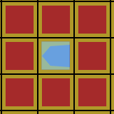
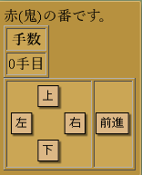
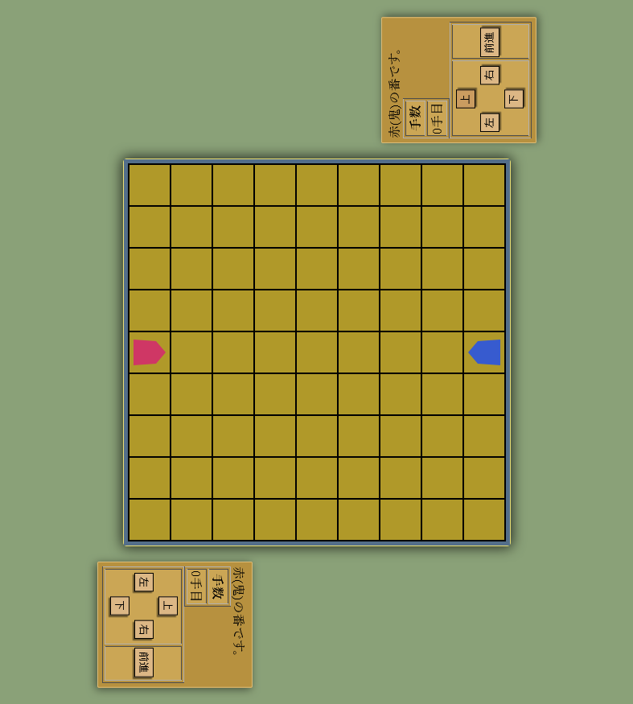
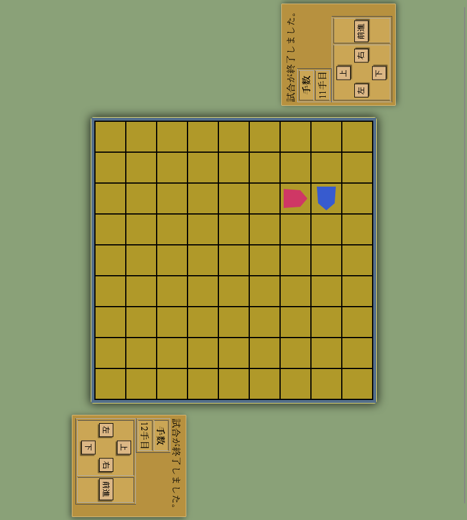

# 鬼ごっこのゲーム

[added English article, please look after the Japanese article]

これは私が適当に考えた、鬼ごっこをするゲームです  
非常にシンプルなので他の人のものとそっくりだったり、一緒だったりするかもしれませんがお許しください  

## ルール(仕様)
- 各駒は向き(上下左右)と位置を保持している
- 各駒は一回の操作で、「方向転換」又は「前に進む」ができる
- フィールドの外には移動できない
- 2人のプレイヤが交互に操作を行う
- ゲームは鬼の操作から始める
- 鬼が子の周囲9マスに入ったらゲーム終了
- ゲーム終了までの手数を逃げる側の得点とする
- 無効な操作を選択した場合、有効な操作に選択しなおす

### ゲーム終了の判定
子(青色のマス)とそれに隣接する8マス(赤色のマス)の合計9マスの中に、鬼が入るとゲーム終了となる  
この判定は、各プレイヤの操作の直後に行う  

## この実装について
html,js,cssで構成されており、ブラウザで動作することができます  
現在、画面のサイズ等は特に考慮されない仕様になっている為、
見切れている場合はブラウザ側の表示スケールを変更する等の対処を行ってください  
(見切れているかの判定には見た目を参考にして下さい)  

見た目は将棋をまねています  
赤の駒が鬼(追う側)で、青の駒が子(逃げる側)です  

### 操作方法
鬼は左下、子は右上のコントローラで操作します  
上下左右のボタンを押すと方向転換、前進を押すと駒が向いている方向に1マス進みます  
操作が完了すると、上部の表示が相手に切り替わります  
無効な操作を選択した場合は切り替わらないので、操作を選択しなおしてください  

### 見た目

ゲーム開始時の状態  

ゲーム終了時の例  

# Tag Game

[i'm not good at writing english sentence well, so sometimes it is better to use translation-software than read this]

This is a game about tag game, without deep thinking.  
it is quite simple, so it might be similar to others , sorry.  

## Rule (as simple)
- each of piece have a data about the direction and the position
- each of piece can change the direction or move forward
- all players can't move outside of the field
- 2 players alternately control each piece
- the game starts with the demon's moving
- when the demon enter 9 positions around the child, the game ends
- the number of the child's actions untill the end of the game is the score
- if the player select the unavailable action, reselect available action

## Check Of the Game Ends
if the demon enter 9 positions (red cells) around the child (the blue cell), the game ends.  
run the cheking after the all of player's action.
when the game ends, letters of the upper side display changes to "試合が終了しました。", means "the game ended".  

## About the Application
this application consists of HTML,Javascript and CSS.  
if the applicatoin's interface is not visible on the screen, please change the scale in the browser.
(please confirm images in the appearance-section to check it)

the appearance of this application imitates to the Shogi, Japanese traditional game.
the red piece is the demon and the blue piece is the child.

## controller
use the down-left controller to control the demon, and use the top-right controller to control the child.  
push "上","下","右","左" buttons to change the direction, these button's letter meen "up","down","right","left".  
push "前進" to move forward, this button`s letter means "move forward".  
when done the action, upper side display changes.  
if the display don't change, you don't select acailable action. please reselect available action.  

### appearance

the initial status  

example of the last status  
